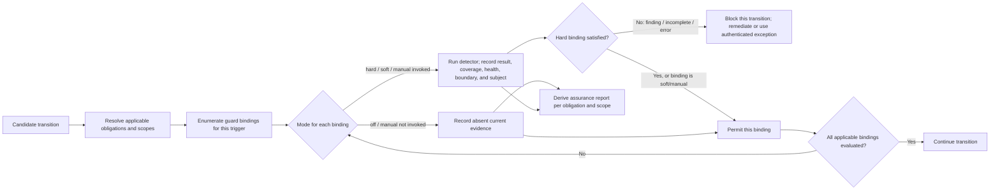

# Risk-tiered guardrails for obligations an agent may forget

**Status:** proposed
**Researched:** 2026-07-22
**Task:** 2026-07-22-design-critical-agent-guardrails

## Recommendation

Build a small, layered guardrail system around this rule:

> Hard, narrow invariants at irreversible boundaries; flexible, inspectable evidence
> everywhere else.

Do not turn the handbook into one universal blocking checklist. Classify each obligation
by consequence, reversibility, and detectability. Preferences stay as guidance;
repairable drift becomes a reconciler finding; judgment-heavy risks can request explicit,
content-bound review; and a policy requiring protection at a disclosure boundary binds
the relevant guards in `hard` mode at independently controlled enforcement points.

The proposed “acknowledge button” is useful because it interrupts the normal path and
demands current dispositions. A self-authored receipt proves neither that the agent read
the evidence nor that its judgment was correct; it is a deliberate nudge plus an
auditable claim. For PII or credentials, it can complement scanners but cannot override
a confirmed critical finding.

### Human review disposition

The owner reviewed this proposal and narrowed its initial adoption:

- do not build or require a capability sandbox now;
- ship proposed guard mechanisms as templates, not automatically active policy;
- use one versioned configuration surface to select each guard's mode; and
- keep token-expensive independent-agent review manual by default rather than running it
  on every change.

On 2026-07-23, the owner explicitly confirmed that every repository guard should use
the same four mode semantics:

| Mode | Automatic behavior | Transition effect |
|------|--------------------|-------------------|
| `hard` | runs at its declared trigger | finding, incomplete coverage, or error blocks that transition |
| `soft` | runs at its declared trigger | reports evidence and remediation without blocking |
| `off` | does not run | records that the guard contributes no current evidence |
| `manual` | runs only when explicitly invoked | produces evidence but is not an always-on gate |

On 2026-07-24, the owner rejected “assurance profile” as selectable configuration.
Repositories configure guard bindings, while AgentFold derives evidence-backed
assurance separately for each obligation and scope. The owner also kept controlled
egress outside approved work unless a separate proposal receives explicit human
approval.

The configuration controls invocation, not truth. Selecting `off` or `manual` for a
critical guard removes that guard's automatic evidence from the derived assurance
report; it cannot still claim that the guard enforced a boundary. A separately
controlled provider rule may remain mandatory even when repository-local automation is
off. Mode changes are ordinary reviewed policy changes, never an implicit exception
written inside a detector.

Unless a later section explicitly says otherwise, words such as “block,” “reject,” and
“fail closed” describe a `hard` guard binding required at that transition. In `soft`,
the same result is reported without stopping the transition; in `manual`, it affects
only an explicitly requested run; in `off`, the guard supplies no result.

### Review vocabulary and concrete differences

The first PR review compressed several distinct concepts into unexplained yes/no
questions. Use these definitions when reviewing or implementing the design:

| Concept | What it controls or proves | Small example |
|---------|----------------------------|---------------|
| Guard mode | How one guard runs at one declared trigger | A PII scanner in `soft` reports a finding and permits the commit; the same scanner in `hard` blocks that commit. |
| Guard binding | One obligation, declared content scope, detector, lifecycle trigger or enforcement boundary, and mode | The same credential scanner may be `soft` on a staged tree and separately `hard` at remote admission. |
| Derived assurance report | Current evidence-backed capabilities and gaps for one obligation and declared scope | Credentials may simultaneously show repository admission for covered patterns and manual semantic-review evidence only for the exact revision on which it ran. |
| Template-first adoption | What AgentFold makes available without silently activating policy | Independent-agent review ships discoverably in a template as `manual`; an adopter must explicitly choose `hard` or `soft` to run it automatically. |
| Self-authored acknowledgement | An untrusted, content-bound reminder that the producing agent considered an ambiguous case | The agent records why a public business email is allowed; this is useful audit evidence but not independent approval. |
| Authenticated exception | Separate authority to permit a confirmed critical finding at a precisely bound destination | A human/provider approval may allow one content digest on one internal ref until expiry; the producing agent cannot grant this by writing `approved`. |
| Detector failure state | Evidence that inspection was incomplete rather than clean | A crash or zero scanned files when files were expected blocks only in `hard`; `soft` reports the incomplete run and continues. |
| Incident recovery | Post-disclosure containment, not permission to continue | Rotate an exposed credential first, then clean history and inventory clones, logs, artifacts, mirrors, and caches. |

These concepts are deliberately separate. Modes configure guard bindings; assurance is
observed, not selected. There is no single deployment-wide scalar and no
feature-selectable assurance label. Several capabilities may coexist for one obligation,
while another obligation in the same change has different evidence and enforcement.
An acknowledgement addresses forgetfulness but cannot authorize a critical exception.
A detector error is neither a finding nor a clean result. Recovery starts only after
possible disclosure and cannot turn that disclosure into a successful guard run.

At a transition, the harness resolves applicable obligations and scopes, enumerates
their guard bindings, runs or skips each binding according to its mode, records result,
coverage, health, boundary, and exact subject, then enforces every applicable `hard`
requirement. Only after that does it derive the report. An agent may help inventory
controls and explain evidence; it cannot strengthen the report by writing a label.

## Context and current gap

Current enforcement is owned by `roadmap/current-state.md` and
`automation/AGENTS.md`. Against those sources, the missing content- and evidence-level
guardrails are:

- a data classification defining what “PII must not be committed” means;
- staged-content, new-object, or history scanning;
- separate clean, finding, incomplete, and detector-error results;
- evidence tied to the exact content reviewed;
- a remotely authoritative admission control that survives `--no-verify`;
- protected, expiring exceptions; or
- canaries proving the detector and its configuration are alive.

This matters because an instruction can fall out of context, a test can be wrong, and a
correctly running detector can still miss contextual PII. Microsoft Presidio explicitly
warns that automated detection cannot find all sensitive information and recommends
additional protections ([Presidio](https://microsoft.github.io/presidio/)). Git itself
documents that local pre-commit hooks are bypassable, while a server-side pre-receive
hook can reject an entire push ([Git hooks](https://git-scm.com/docs/githooks)).

## Scope and non-goals

This design covers obligations that affect repository content, Git history, PR/merge
admission, and the agent's filesystem-facing workflow. PII is the representative hard
case because disclosure is not repaired merely by a later commit.

This design does not:

- claim that any scanner proves the absence of all PII;
- require one agent vendor, model, hosted Git provider, or policy engine;
- prescribe how an agent must investigate or implement ordinary work;
- make every handbook preference a gate;
- defend against a malicious repository administrator who controls policy, checks,
  branch protection, and audit history;
- make CI the first privacy boundary—content on a PR branch has already reached the
  remote system; or
- include a filesystem/network capability sandbox in the initial implementation.

Controlled egress is a reference-only future possibility, not approved scope. It would
require a separate design for external filesystem/network controls and guarded
credentials. AgentFold must not ship a controlled-egress mode, template, adapter, task,
or implementation unless a user explicitly approves that separate proposal.

## How this design was made

The investigation used a breadth-first architecture pass before choosing a combination:

1. State obligations and failure consequences.
2. Classify detectability, reversibility, and disclosure boundaries.
3. Enumerate mechanism families without ranking them.
4. Place each mechanism at every plausible lifecycle point.
5. Record bypasses, detector failure, false positives, and controlling authority.
6. Compare complete layer combinations, not favorite tools in isolation.
7. Deepen the highest-risk case—PII—and adversarially test the recommendation.

This is a lightweight version of the scenario-and-trade-off shape in SEI's
[Architecture Tradeoff Analysis Method](https://www.sei.cmu.edu/library/architecture-tradeoff-analysis-method-collection/).
It also matches GitHub Spec Kit's separation of specification, plan, tasks, and
cross-artifact analysis ([Spec Kit](https://github.github.com/spec-kit/reference/agentic-sdd.html)).

## Agent-oriented design principles

### Enforce consequences, not a favorite workflow

State the end condition—such as “no prohibited sensitive data becomes reachable from a
protected ref”—and let the agent choose its investigation and remediation path. Exact
tool-call grading punishes valid alternatives; deterministic final-state graders are
preferable when the outcome is mechanically observable
([Anthropic agent evals](https://www.anthropic.com/engineering/demystifying-evals-for-ai-agents)).

### Separate must-be-true from must-be-considered

A machine-checkable safety property needs a gate. A qualitative concern may instead
need evidence that the exact artifact was inspected. Calling both “checks” hides the
difference between proof, a fallible signal, and an attestation.

### Separate policy, detection, evidence, and enforcement

Policy says what is prohibited and how uncertainty is handled. Detectors produce
signals and coverage. Evidence binds those results and dispositions to content.
Enforcement decides whether a transition may proceed. Keeping these roles separate
makes detectors replaceable without changing the invariant. OPA uses the same broad
policy-decision/enforcement separation, although adopting OPA is unnecessary here
([OPA documentation](https://www.openpolicyagent.org/docs)).

### Make failure actionable and safe to display

A rejection should identify the invariant, category, an opaque locator, coverage,
remediation choices, and exception route. It may show a path only after the path itself
passes the sensitive-data check; otherwise it shows a redacted label and leaves the
ID-to-path mapping in an access-controlled local report. It should not echo the matched
PII or secret into a terminal, CI log, agent transcript, or review comment. SWE-agent's agent-computer
interface work shows the value of immediate, precise tool feedback
([SWE-agent ACI](https://swe-agent.com/0.7/background/aci/)).

### Bind evidence to exact bytes and policy

“Reviewed: yes” is replayable. A useful receipt binds to a defined subject envelope:
tree or blob IDs, parents, identities, message content excluding receipt fields, the
relevant policy slice, detector version, finding IDs, disposition, actor, and expiry.
This avoids circularly hashing a receipt inside its own commit and covers metadata that
a tree-only digest misses. A finding-level disposition carries forward only when its
path, blob, rule, relevant policy slice, and detector-declared context dependency digest
are identical. A contextual detector declares whether it depends on a directory, linked
records, or the whole candidate tree; an absent dependency manifest disables reuse.
Unrelated edits outside that set regenerate the run manifest without demanding new
judgment. This follows the same artifact-binding idea used by SLSA verification
([SLSA verification summary](https://slsa.dev/spec/v1.2/verification_summary)).

A self-authored receipt remains an untrusted claim even when perfectly bound. Evidence
that authorizes a critical exception additionally binds repository identity, destination
sink, ref, and required enforcement boundary and needs an authenticated external
principal: for example, a protected provider approval/check record or a signature whose
key is unavailable to the producing agent.

### Treat the verifier as attack surface

A critical check distinguishes pass, finding, incomplete coverage, runtime error, and
not applicable. It returns incomplete coverage on zero scanned inputs when inputs were
expected. Scanner,
workflow, fixtures, policy, allowlists, and waiver changes receive stronger ownership
than ordinary code. The design tests both positive and negative cases and never turns a
crash into “clean.”

In `hard` mode, failure closed applies at the protected transition, not to every kind of
work. Keep a pinned, minimal offline detector as the portable baseline; optional
semantic/provider detectors may degrade only according to declared policy. During an
outage, agents can inspect and repair locally, but a hard-mode commit/push/merge
transition remains blocked. An operational break-glass is distinct from a content
false-positive waiver: it is short-lived, scope- and revision-bound, authenticated by a
separate owner, and cannot silently change an error into clean. If neither
last-known-good verification nor an authorized break-glass exists, a hard confidentiality
boundary intentionally wins over availability. `soft` reports the outage and continues;
`manual` reports it only when invoked; `off` makes no detector-health claim.

### Use independent layers with different failure modes

Running the same buggy script twice is availability redundancy, not detection diversity.
Useful layers differ: structured patterns and checksums, contextual classification,
direct artifact inspection, a separately controlled remote gate, and sampled
human/independent-agent review. OWASP likewise treats an LLM guardrail as one layer,
not a replacement for input validation, least privilege, and approval on high-risk
actions
([OWASP prompt-injection prevention](https://cheatsheetseries.owasp.org/cheatsheets/LLM_Prompt_Injection_Prevention_Cheat_Sheet.html)).

### Put authority at the last safe choke point

Local hooks optimize feedback. They are not the authority because they may be absent or
bypassed. For accepted Git history, authority belongs at pre-receive/push protection
when available; protected required checks govern merge. GitHub rulesets can require a
status check from an expected app
([GitHub rulesets](https://docs.github.com/en/repositories/configuring-branches-and-merges-in-your-repository/managing-rulesets/available-rules-for-rulesets)).

Repository admission applies only to the declared Git surfaces that its observed
controls cover. It does not imply protection for unrelated provider APIs, logs,
artifacts, publications, or network access; those broader claims are outside this
design.

### Make escape hatches narrower than the rule

A legitimate exception is finding-specific, content-bound, attributable, reasoned,
expiring, and visible. The producing agent cannot self-approve a confirmed critical
finding. GitHub's delegated push-protection bypass follows this requester/approver split
([GitHub bypass requests](https://docs.github.com/en/code-security/concepts/secret-security/bypass-requests)).

### Add friction only when the evidence changes

A static acknowledgement becomes wallpaper. Security-warning research observes rapid
habituation to repeated warnings
([warning habituation study](https://pmc.ncbi.nlm.nih.gov/articles/PMC7751389/)).
Trigger deliberation from risk or a finding, require per-finding dispositions, and
invalidate a disposition when its path, blob, finding, policy, or declared contextual
dependencies change.

### Keep harness assumptions removable

Every non-security scaffold should name the model weakness or failure history it
compensates for and have an eval that can show whether it remains load-bearing.
Anthropic's long-running harness work recommends removing components one at a time as
models improve, while constraining deliverables more than implementation details
([harness design](https://www.anthropic.com/engineering/harness-design-long-running-apps)).
Security boundaries remain even when models improve because they also defend tool bugs,
prompt injection, configuration mistakes, and compromised actors.

## Obligation taxonomy

The same mechanism should not govern taste and disclosure.

| Tier | Meaning | Typical available treatment | Examples |
|------|---------|-----------------------------|----------|
| Preference | Failure is cheap and subjective | concise contract guidance; no receipt | naming taste, prose style |
| Repairable invariant | Wrong state is detectable and reversible | reconciler advisory, optionally hard near a transition; retry queue | stale handover, broken link |
| Deliberation required | Consequence is meaningful but judgment is necessary | risk-triggered inspection plus content-bound receipt; optional manual independent review | migration trade-off, ambiguous public contact data |
| Critical boundary | Disclosure or action is expensive or irreversible | hard-capable independent detectors and remote controls, plus separate approval for exceptions; weaker modes must advertise weaker assurance | prohibited PII, active credentials, destructive release |

Classification is driven by consequence, reversibility, detectability, and where the
last safe boundary sits—not by words such as MUST in prose.

## Breadth-first choice space

### Mechanism families

| Mechanism | What it contributes | Characteristic failure |
|-----------|---------------------|------------------------|
| Contract or task prompt | cheap orientation and provenance | forgotten, compacted, or overridden by untrusted content |
| Template/checklist | forces named questions into an artifact | boilerplate and stale answers |
| Dynamic acknowledgement | interrupts the normal path and requests current dispositions | forgeable self-claims, rubber-stamping, and warning fatigue |
| Deterministic check | repeatable proof for narrow syntax/structure/patterns | blind spots, bad configuration, crashes |
| Semantic scanner | contextual PII/content signal | false positives/negatives, locale and model gaps |
| Sandbox/quarantine | limits what an agent may read, write, or transmit | policy can over-constrain work; not portable to every agent |
| Local Git hook | immediate staged-content feedback | uninstalled or bypassed with `--no-verify` |
| Remote admission | rejects incoming objects before refs update | needs server/provider control; remote still processes the push |
| Required CI/merge check | clean-environment replay and merge authority | too late to prevent transmission to the remote branch |
| Independent review | semantic challenge and common-sense coverage | correlated model blind spots and review fatigue |
| Reconciler/history scan | convergence and new-detector backfill | detects confidentiality loss after the fact |
| Waiver/break-glass | makes legitimate exceptions possible | broad, permanent, or self-approved bypasses |

### Enforcement times and honest guarantees

| Time | Best use | Guarantee ceiling when selected and healthy |
|------|----------|---------------------------------------------|
| While editing | workspace/output scan and rapid correction | educational feedback; incomplete and agent-controlled |
| Pre-commit | exact staged-tree scan and acknowledgement interlock | prevents ordinary local commits only |
| Pre-push | scan every outbound commit and object | prevents ordinary pushes only; still client-controlled |
| Pre-receive / push protection | quarantine and reject new objects centrally | prevents accepted remote history; remote necessarily receives/processes the attempted push |
| PR CI | diverse rescans, policy tests, ownership, evidence validation | prevents merge, not remote disclosure |
| Merge queue | retest the prospective merged result | prevents stale-base merge gaps when configured correctly |
| Scheduled/history | catch new signatures, bypasses, and legacy leaks | detection and response, not prevention |

### Candidate architectures

| Approach | Strength | Fatal weakness |
|----------|----------|----------------|
| Instructions and checklists only | portable, flexible, almost free | critical compliance depends on memory and honesty |
| One universal pre-commit gate | simple mental model and fast feedback | bypassable; false positives and detector errors can deadlock all work |
| One “smart” PII scanner | catches context patterns regex misses | remains a fallible oracle and a sensitive-data processor |
| Independent reviewer agent | useful semantic critique | shared blind spots; no deterministic boundary; ongoing cost |
| Risk-tiered layered evidence gates | matches friction and authority to consequence; replaceable detectors | more design work; strongest guarantees need hosting/infrastructure support |

The last approach is recommended. The others remain useful mechanisms or guard bindings,
but none should be advertised as a complete PII guarantee by itself.

### Derived assurance reports

Assurance is observed, not selected. An adopter configures individual guard bindings; it
does not turn a named assurance level on or off. Each binding identifies an
obligation, content scope, detector, lifecycle trigger or enforcement boundary, and one
of the four modes. Multiple bindings may apply to the same change, and the same detector
may be used by different bindings—for example, `soft` before commit and `hard` at remote
admission.

For each obligation and declared scope, the harness derives a current report from
content-bound run manifests, detector coverage and health, enforcement configuration,
and independently observed provider controls. The agent may explain this evidence but
cannot make a stronger claim by writing a label. The claim is bounded by the weakest of
detector coverage, enforcement boundary, and detector health or freshness. Coverage is
stated as examined surfaces, inputs, skips, unsupported cases, limitations, and eval
evidence; it is not converted to a completeness percentage unless an evaluation
actually measures one.

| Observed capability | Minimum current evidence | Honest claim |
|---------------------|--------------------------|--------------|
| Local detection evidence | A local or explicitly invoked guard ran on the bound subject and reported coverage and health | The recorded subject received the stated inspection; local automation remains bypassable |
| Merge prevention | An independently controlled required check ran every applicable covered guard in `hard` mode on the prospective merge result | Covered prohibited findings cannot merge; content may already exist remotely |
| Repository admission | Server pre-receive or equivalent push protection ran every applicable covered guard in `hard` mode over the declared Git surfaces | Rejected objects do not become reachable refs; the host still processed the attempted push |

These capabilities are composable, not levels to choose between. A credential obligation
may show local semantic-review evidence, merge prevention, and repository admission at
once, while documentation style in the same change shows only local feedback. An
uninvoked `manual` guard contributes no current evidence; once invoked, it contributes
only evidence bound to that exact subject and never becomes an always-on gate. If an
observed capability falls below a configured policy minimum, the applicable `hard`
transition blocks. The report describes that result; it does not create enforcement.

## Recommended architecture

### Three planes

1. **Policy plane** — versioned data classification, obligation tier, covered surfaces,
   required enforcement points, detector configuration, owners, and exception rules.
2. **Evidence plane** — coverage manifests, redacted findings, untrusted self-review
   claims, authenticated approvals, detector-health results, and narrow waivers.
3. **Enforcement plane** — small adapters at workspace scan, commit, push, remote
   admission, CI/merge, and scheduled audit. Each consumes policy and evidence; none
   invents policy in its own shell script.

This can remain Python-stdlib-first inside the existing automation service. Optional
provider or semantic-scanner adapters add coverage without becoming a core dependency.
Templates are the adoption boundary: installing AgentFold makes choices visible but
does not silently enable every guard. A possible future layout is illustrative, not a
required schema:

```text
templates/guardrails/
├── config.json                # each obligation/scope/detector/trigger binding -> mode
├── policy.json                # classifications and tier-to-control mapping
└── evidence/                  # receipt, finding, waiver, and run-manifest schemas

automation/guardrails/
├── AGENTS.md
├── config.json                 # adopted repository choices copied from the template
├── policy.json
├── run.py                      # one manual/automatic entry point that reads mode
├── checks/                     # small replaceable detectors
├── adapters/                   # staged, pre-push, CI, provider integration
├── fixtures/
│   ├── pass/                   # must not trigger
│   ├── finding/                # must trigger
│   └── error/                  # detector failure must not become clean
└── waivers/                    # one protected, expiring exception per file

tmp/guardrails/                 # ignored local reports; never raw matched literals
```

The root reconciler can validate the policy/evidence schemas and expiry without owning
the detectors themselves. The runner reports `off` and uninvoked `manual` bindings as
absent current evidence, while an invoked manual binding contributes evidence only for
its exact subject. Neither state can be confused with a clean automatic run.

“Template-first” therefore means opt-in activation, not missing documentation or an
endorsed end-to-end workflow. AgentFold ships discoverable, replaceable mechanisms and
one mode surface; an adopted repository chooses which mechanisms run. Enabling a starter
bundle automatically would provide stronger defaults, but it would also impose token
cost, false-positive friction, and one workflow before an adopter has chosen that
trade-off.

### Transition model



In `hard` mode, critical findings do not take the self-receipt path. They are removed,
sanitized, or sent through a separately approved waiver. A scanner crash, timeout,
unreadable file, or unexplained skip is incomplete coverage—not clean—but only `hard`
turns that outcome into a transition block. Soft and invoked-manual runs preserve the
result as evidence and continue; off and uninvoked-manual paths make no inspection
claim. A merge binding is explicitly weaker than a repository-admission binding:
content reaches the remote before CI, and the report must say so. Other independently
observed bindings may still contribute their own capabilities for the same obligation.

### Content-bound acknowledgement

For the deliberation tier, a local guard configured `hard` may intentionally fail once
and generate a challenge. A soft or explicitly invoked manual run can generate the same
challenge without stopping the transition. The agent inspects the staged diff and
redacted report, records a disposition
for every finding ID, and asks the acknowledgement command to bind the receipt to:

- the defined candidate envelope: repository identity, destination transition/ref and
  required enforcement boundary, staged tree, parents, identities, and commit message
  with receipt fields removed;
- the relevant policy slice and detector version;
- surfaces, redacted path locators, bytes, and file types examined;
- explicit skipped, unreadable, timeout, and not-applicable counts;
- stable finding IDs and dispositions, without matched literals;
- claimed attester identity, rationale, timestamp, and expiry.

A Git commit trailer is a reasonable portable carrier for a self-authored deliberation
claim because the envelope can exclude the trailer and avoid a circular digest. Hard CI
where policy requires this receipt can reject structurally stale claims, but it cannot
prove the agent read anything. An
unchanged finding-level disposition carries forward when its path, blob, rule, relevant
policy slice, and declared context dependencies match; the new run manifest records that
reuse so genuinely unrelated changes do not create warning fatigue. A contextual
detector that cannot enumerate dependencies binds to the whole candidate tree.

A critical authorization uses a different carrier: a protected provider approval/check
record or a cryptographic signature verified against a trusted identity whose credential
is unavailable to the producing agent. A plain approver name in a file is not authority.
A committed evidence file is only an audit container unless it carries that verifiable
external assertion.

## PII and credentials worked design

### Define the actual invariant first

“No PII in Git” is underspecified: ordinary commit objects contain author and committer
names and email addresses
([git-commit-tree](https://git-scm.com/docs/git-commit-tree.html)), and names or email
addresses may be intentionally public. NIST treats PII impact as contextual and
risk-based ([NIST SP 800-122](https://csrc.nist.gov/pubs/sp/800/122/final)).

The policy should distinguish:

- permitted repository metadata, preferably pseudonymous or noreply where appropriate;
- prohibited real customer, employee, patient, or private operational data;
- credentials and cryptographic material, which have different detection and incident
  response from general PII;
- controlled public, synthetic, or fixture data with narrow provenance; and
- combinations of fields that become identifying only together.

Recommended invariants:

- Prohibited sensitive data does not become reachable from a protected Git ref.
- Guardrail output never reproduces a matched sensitive literal.
- Incomplete coverage or detector failure is never reported as clean.

This repository design makes no broader no-transmission claim: a rejected remote push
was still transmitted to and processed by the host. Broader boundaries are outside the
approved scope stated above.

### Covered surfaces

Scanning only added text in the final diff is insufficient. The Git policy inventory
should consider tracked blobs, every new commit in a push, content added and deleted in
an intermediate commit, commit/tag messages, author identities, filenames, symlinks,
submodules, archives, images/OCR, binary metadata, and generated repository files. Each
run emits what it covered and what it skipped.

| Git surface | Coverage requirement |
|-------------|----------------------|
| Candidate tree | inspect the exact blobs and relevant metadata bound to the local evidence |
| Push range | inspect every newly introduced object, including content later deleted by another commit |
| Protected ref or merge result | inspect the prospective accepted history under the independently observed rule |
| LFS pointers, submodules, archives, images, and unsupported binaries | report whether content was inspected, delegated to a named detector, or explicitly unsupported; never treat the pointer or skip as complete coverage |

### Ingress and direct inspection

The initial implementation begins with repository content already available to the
agent; it does not promise sandboxed ingress. The agent may inspect sanitized input,
tool output, generated files, and the exact staged diff to catch contextual PII that
patterns miss.

Direct agent inspection is secondary evidence. If showing raw data to the model would
itself violate policy, the harness must route review to an approved local model or human;
it must not print the raw value into a prompt merely to ask whether the value is PII.

### Local feedback

When a local guard is configured to run, use cheap structured patterns, checksums,
organization-specific tokens, high-entropy signals, and file-type/coverage checks over
the staged candidate. On a finding, emit only
category, an opaque locator, and a path only when the path is independently clean. A
sensitive filename is replaced with a redacted label and resolved only inside the
access-controlled local inspection path. Low-entropy PII should not be hashed without a
key because dictionary guessing can recover it; durable fingerprints need a protected
keyed construction or must avoid value-derived IDs.

Ambiguous contextual findings may take the content-bound review route. In `hard` mode,
active credentials and high-confidence prohibited identifiers block the configured
transition. In `soft` or an invoked `manual` run they are reported without blocking and
that binding contributes no automatic protection at the boundary; another independently
observed binding may still support its own narrower claim. In `off` they are not
inspected by this guard. If a credential may have escaped the approved boundary, revoke
or rotate it before cleaning history.

### Remote authority

When an observed remote-admission binding exists and is `hard`, run its covered guards
over all newly reachable objects in pre-receive quarantine and reject atomically. On
GitHub, push protection and delegated bypass can provide that binding for supported
secrets, recognizing that secret scanning is not general PII scanning
([GitHub push protection](https://docs.github.com/en/code-security/concepts/secret-security/push-protection)).

When an applicable merge binding is `hard`, required CI replays its policy in a clean
environment, preferably with at least one different detector or configuration, validates
self-receipt freshness and external waiver authority, checks detector canaries, and
scans the prospective merge result.
Rules protect the scanner, workflow, policy, fixtures, and waiver paths themselves.
The derived report states merge prevention or repository admission only from the
corresponding observed evidence. Without remote admission, it says “cannot merge,” not
“cannot reach the remote.”

### Exceptions and recovery

A critical exception is requested by the producing agent and approved by a distinct
principal. It contains no sensitive literal and cannot suppress an entire directory.
Its signed subject includes the finding/category, repository identity, destination sink,
ref or transition, required enforcement boundary, covered content and context digests,
reason, and expiry, so approval for an internal ref cannot be replayed to another
destination. The gate verifies a protected provider approval record or a signature
against a trusted key whose credential is outside the agent's capability set. An
`approver:` string written by the agent is not approval.

Scheduled full-history scans catch new signatures and expired waivers. A later leak is
an incident, not a normal retry: contain access, revoke credentials, inventory every
exposure surface, remove or rewrite history where justified, coordinate clones/forks and
host caches, delete affected logs/artifacts, then add the miss as a regression fixture.
GitHub notes that history rewriting does not clean other clones or every cached surface
([removing sensitive data](https://docs.github.com/en/authentication/keeping-your-account-and-data-secure/removing-sensitive-data-from-a-repository)).

## Detector validation and coverage

Every detector or policy change runs:

- positive fixtures that must be findings;
- negative and synthetic fixtures that must remain usable;
- adversarial encodings, split values, Unicode, archives, images, large files, and
  content introduced then deleted within one push;
- crash, timeout, missing-model, unreadable-file, and zero-input cases; and
- a coverage assertion listing counts and skips.

Real misses become regression fixtures. Capability evals—how much a new semantic scanner
can catch—remain separate from regression gates that should stay near 100% pass. Review
samples of diffs and detector output periodically because a green grader can encode the
wrong behavior.

## Preserving room for smarter agents

The durable constraints in this design sit at trust and data boundaries. Everything
inside those boundaries remains open:

- policy declares outcomes and evidence, not a fixed sequence of tool calls;
- scanners and provider integrations are adapters, not framework dependencies;
- one universal mode surface makes every guard removable or manually invocable without
  changing its implementation;
- receipts trigger only on risk or findings, not every commit;
- independent-agent review is manual by default and reserved for unresolved
  high-consequence judgment;
- each non-security scaffold carries a hypothesis and eval so it can be ablated; and
- a stronger future agent may satisfy the invariant with better evidence without asking
  permission to use a better internal method.

This is deliberately less paved than an end-to-end agent workflow. The harness decides
what may cross a boundary, not how intelligence must work on the safe side of it.

## Decision and rejected directions

Choose the risk-tiered layered design as a template-first, mode-configurable system.
Keep the existing reconciler for repository-state invariants, offer replaceable
obligation checks without enabling them all by default, use local hooks only for guards
configured to run there, and add remote authority when the deployment supports it. Do
not include a capability sandbox in the initial implementation.

Reject these as sole solutions:

- more prose—the failure is forgetting;
- a universal blocking reconciler—advisory drift and confidentiality do not share a
  severity or recovery model;
- a generic acknowledgement—the agent can learn to click through it;
- one PII model—its own vendor says detection is incomplete;
- an always-on guard bundle—costly review becomes wallpaper and adopters lose control;
- CI-only scanning—remote disclosure has already occurred; and
- a mandatory multi-agent workflow—valuable for high-risk review, unnecessary ceremony
  for routine work, and still subject to correlated blind spots.

## Implementation sequence

1. Define the universal guard configuration template and exact `hard`, `soft`,
   `off`, and `manual` runner semantics.
2. Define the data/obligation policy, Git-surface inventory, guard bindings, and
   derived-assurance report schema before choosing a scanner.
3. Add a manually invocable stdlib coverage/result protocol and synthetic
   pass/finding/error canaries.
4. Offer fast staged-tree feedback with redacted diagnostics; adopters choose its mode
   instead of receiving an always-on hook.
5. Add risk-triggered, content-bound self-receipts for deliberation-tier findings,
   including dependency-aware carry-forward for unchanged finding subjects. Keep
   independent-agent review `manual` in the starter template.
6. Add authenticated external approval for critical and operational exceptions; protect
   policy/check/fixture/waiver changes and validate authority where enabled.
7. Offer pre-push and pre-receive/provider-admission adapter templates for declared Git
   surfaces; report every unguarded, unsupported, or disabled surface and never infer
   coverage.
8. Verify active deployment capabilities with canaries, then add optional scheduled
   history scans and an incident/outage exercise.
9. Measure false negatives, false-positive burden, bypass rate, detector errors,
   remediation success after feedback, and whether agents game receipts.
10. Periodically ablate non-security scaffolding against held-out agent evals.

Each step can land independently. No step should weaken the existing repository when a
later, provider-specific layer is unavailable. Sandboxing or any broader non-Git
boundary requires a separate future design and explicit human approval; neither is a
prerequisite or approved implementation step here.

## Research sources

Primary and authoritative sources used in the breadth pass:

- [OpenAI harness engineering](https://openai.com/index/harness-engineering/) — short
  root map, structured design docs, plans, and mechanical documentation checks.
- [GitHub Spec Kit](https://github.github.com/spec-kit/reference/agentic-sdd.html) —
  specification, research, plans, tasks, and consistency/convergence analysis.
- [Software Engineering at Google: Design Docs](https://abseil.io/resources/swe-book/html/ch10.html)
  — goals, trade-offs, alternatives, and design review.
- [Anthropic: Building effective agents](https://www.anthropic.com/engineering/building-effective-agents)
  — simple composable patterns, parallel workers, evaluators, and environmental feedback.
- [Anthropic: Writing tools for agents](https://www.anthropic.com/engineering/writing-tools-for-agents)
  — clear tool boundaries, held-out evals, and avoiding strategy overfitting.
- [Governance Decay](https://arxiv.org/abs/2606.22528) — experimental evidence that
  lossy context compaction can remove governance constraints.
- [Git hooks](https://git-scm.com/docs/githooks) and
  [receive-pack quarantine](https://git-scm.com/docs/git-receive-pack) — local bypass
  and remote rejection semantics.
- [GitHub secret-scanning scope](https://docs.github.com/en/code-security/reference/secret-security/secret-scanning-scope)
  — documented skips, timeouts, pattern, and push-protection limits.
- [Microsoft Presidio](https://microsoft.github.io/presidio/) — multi-method PII
  detection and its explicit non-guarantee.
- [Yelp detect-secrets design](https://github.com/Yelp/detect-secrets/blob/master/docs/design.md)
  — heuristic scanning, baselines, audits, and human interpretation.
- [NIST SP 800-122](https://csrc.nist.gov/pubs/sp/800/122/final) — contextual PII
  identification and impact-based protection.
- [NIST SSDF](https://csrc.nist.gov/pubs/sp/800/218/final) — security practices
  integrated across the software lifecycle.
- [OWASP AI Agent Security](https://cheatsheetseries.owasp.org/cheatsheets/AI_Agent_Security_Cheat_Sheet.html)
  — least privilege, input/output validation, separation of decision and execution,
  and adversarial testing.
- [GitHub rulesets](https://docs.github.com/en/repositories/configuring-branches-and-merges-in-your-repository/managing-rulesets/available-rules-for-rulesets)
  — protected required checks, expected sources, and merge controls.
- [GitHub push-protection bypass](https://docs.github.com/en/code-security/concepts/secret-security/bypass-requests)
  — audited, delegated exception handling.
